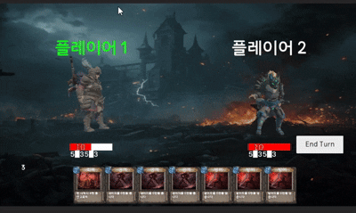
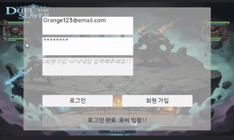
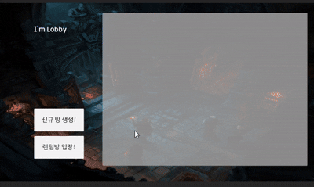

# Dual The Slayer

> Slay the Spire 스타일의 덱 빌딩 카드 게임을 포톤 네트워크를 이동해 1:1 전투로 구현한 프로젝트 입니다.

프로젝트 목표 : 포톤 네트워크 및 Firebase DB를 활용하며 깊은 이해와 Slay the Spire 방식의 게임 형식을 구현

프로젝트 기간: 2026.01.13 ~ 26.02.04 (23일)

## 라이브러리 목록
- Firebase : 유저 데이터 관리 및 인증
- Photon Pun2 : 멀티플레이 동기화

## 기술 스택
### 아키텍처
- **MVP 패턴**: UI와 로직을 분리하여 유지보수 및 테스트 용이성 향상
- **ScriptableObject** : 데이터 중심 설계 및 확장성 확보
### 네트워크 & DB
- **Firebase** : 유저 데이터 관리 및 인증
- **Photon Pun2** : 멀티플레이 동기화
### 성능 최적화
- **오브젝트 풀링** : 카드 생성/ 삭제 시 발생하는 GC성능 최적화
### 알고리즘
- **Fisher-Yates Shuffle** : 카드 랜덤 섞기 구현

## ADR (Architecture Decision Record)

### ADR-001: Firebase 기반 데이터 관리
- 상황: 클라이언트에서 직접 데이터를 관리할 경우, 사용자가 데이터를 조작하거나 신뢰성이 떨어지는 문제가 발생
- 결정: 서버 기반 데이터 관리를 위해 Firebase 도입
- 사유: 클라이언트 데이터 변조를 방지하여 신뢰성 확보, 유저 데이터를 중앙 관리 가능

### ADR-002: Photon PUN2 기반 멀티플레이 구현
- 상황: 싱글 플레이 구조는 여러 유저가 동시에 플레이하며 실시간 상호작용이 불가능
- 결정: 실시간 멀티플레이 구현을 위해 Photon PUN2 도입
- 사유
	- 1. 별도의 어려운 서버 구축 없이 빠르게 멀티플레이 환경 구현 가능
	- 2. RPC 및 상태 동기화를 통해 플레이어 간 상호작용 처리
	- 3. Photon PUN2 vs Fusion: Fusion은 높은 성능과 최신 네트워크 구조를 제공하지만, 프로젝트 진행 당시 학습 자료 및 레퍼런스가 적어 리스크 존재. 
		 PUN2는 학습 자료가 많고, 안정화 된 버전이므로 PUN2를 선택		 
### ADR-003: 오브젝트 풀
- 상황: 플레이어가 카드를 사용할때마다 게임 내에서 반복적으로 생성 및 제거된다면 GC호출로 인한 성능 문제 발생
- 결정: 객체를 미리 생성해두고 재사용하는 오브젝트 풀링 적용
- 사유: Instantiate/Destroy 호출 시 발생하는 메모리 할당 비용 감소 (GC발생을 줄여 성능 저하)
- 성능 측정 : 유니티 프로파일러 확인 결과, 오브젝트 풀을 사용하면 메모리가 약 90% 절감되는 효과
	- 오브젝트 풀 사용  : GC Alloc(8.7 KB)
   	- 오브젝트 풀 미사용: GC Alloc(245.6 KB)
### ADR-004: MVP 패턴
- 상황: 멀티플레이 환경에서 UI, 입력 처리, 네트워크 및 게임 로직이 하나의 클래스에 혼합되면서 기능 수정 시 다른 시스템에 영향을 주는 문제 발생
- 결정: UI(View), 입력 및 상태 처리(Presenter), 데이터(Model)를 분리하는 MVP 패턴 적용
- 사유
1. UI 변경 시 네트워크 및 게임 로직에 영향이 가지 않도록 책임 분리
2. MVP vs MVC : MVP는 입력처리를 View에서 받고, 프레젠터가 그 입력을 처리하지만, MVC는 Controller에서 모든 입력 로직 및 처리를 하기때문에 MVP가 결합도가 낮아 MVP채택
### ADR-005: ScriptableObject 기반 데이터 관리
- 상황: 카드 사용 효과를 코드에 직접 작성하거나 프리팹에 의존할 경우, 데이터 수정 시 코드에서 직접 수정이 필요하고, 수정 시 오브젝트 단위로 수정이 필요하고, 재사용성이 떨어지는 문제가 발생
- 결정: 카드 사용 효과를 ScriptableObject로 분리하여 관리
- 사유: 신규 아이템 및 스킬 추가 시 코드 수정없이 확장 가능, 데이터와 로직 분리하여 유지보수성 향상

### 추가 성능 테스트
1. Fisher-Yates Shuffle 알고리즘 적용
- 상황: 카드를 랜덤하게 뽑는 과정에서 단순 Random 방식 사용 시 카드를 뽑을때마다 매번 랜덤 함수를 실행하며 리스트에서 RemoveAt으로 지워주는 비용이 발생. 런타임 중 성능 문제 발생 가능성
- 결정: Fisher-Yates 알고리즘을 적용
- 사유: 모든 경우의 수에 대해 동일 확률 보장, 간단한 구현으로 안정적인 셔플 로직 구성
- 성능 측정: 유니티 프로파일러 확인 결과, List RemoveAt방식과 Fisher-Yates Shuffle의 성능 차이는 없는 것으로 측정
  	- List RemoveAt: GC Alloc(7.92 KB), 실행시간(2.09 ms)
  	- Fisher-Yates : GC Alloc(8.21 KB), 실행시간(2.06 ms) 

## 사용 방법
Unity 버전(2022.3.62f3) 사용을 권장드립니다.
- Project 폴더의 Assets/Scenes/LoginScene 씬을 Play를 하시면 실행이 가능합니다
- 첫 LoginScene 에서는 회원가입이 필요하므로, 위의 GIF처럼 이메일 형식으로 아이디를 입력하고, 비밀번호는 최소 6글자 이상으로 넣어주시며, 닉네임을 입력해주시고, 회원가입 버튼을 누르면
로그인 버튼이 활성화되고, 로그인이 완료되면 아래의 '로그인 완료. 로비입장!!' 버튼을 클릭하여 로비로 입장하시면 됩니다.

- 두번째 LobbyScene에서는 신규 방 생성을 통해 방을 생성하실 수 있으며, 기존 방을 입장해서 입장도 가능합니다.
네트워크 게임이므로 플레이하는데에 최소 2인이 필요합니다. 2명이 플레이어로 입장하고 게임 시작 버튼을 누르시면 게임 진행이 가능합니다

* 단, 일부 에셋(캐릭터 및 맵 등)의 경우 Unity Asset Store 라이선스 정책에 따라 저장소에 포함되지 않았으며, 
프로젝트 실행을 위해 별도 설치가 필요합니다
* 27.04.17일 이후 사용하게 될때 Firebase realtimeDatabase 권한을 true 설정 필요
